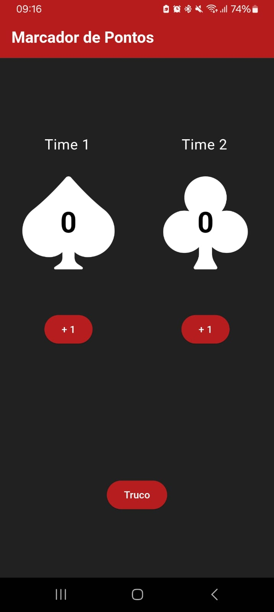

# Marcador de Pontos de Truco

Marcador de Pontos de Truco é um aplicativo simples e intuitivo desenvolvido para ajudar jogadores de truco a acompanhar a pontuação de suas partidas. O aplicativo foi construído usando Flutter, proporcionando uma experiência de usuário rápida e eficiente tanto para Android quanto para iOS.

## Funcionalidades

- **Marcação de Pontos:** Registre e acompanhe a pontuação das partidas de truco de forma fácil.
- **Interface Intuitiva:** Design simples e amigável para facilitar a navegação e o uso durante o jogo.
- **Reset de Pontuação:** Possibilidade de reiniciar a pontuação para iniciar uma nova partida.

## Screenshots




## Tecnologias Utilizadas

- **Flutter:** Framework principal para o desenvolvimento do aplicativo.
- **Dart:** Linguagem de programação utilizada com Flutter.
- **Android & iOS:** Suporte completo para ambas as plataformas.

## Instalação

Para instalar o aplicativo em seu dispositivo, siga as instruções abaixo:

### Android

1. Baixe o APK do aplicativo a partir do [link de download](#).
2. Instale o APK em seu dispositivo Android.
3. Abra o aplicativo e comece a marcar os pontos das suas partidas de truco!

## Desenvolvimento

Se você deseja contribuir para o desenvolvimento deste aplicativo ou simplesmente quer rodar o projeto localmente, siga os passos abaixo:

### Pré-requisitos

- [Flutter](https://flutter.dev/docs/get-started/install) (Versão 2.0 ou superior)
- [Dart](https://dart.dev/get-dart) (Incluso com o Flutter)
- Editor de código (Recomendado: [Visual Studio Code](https://code.visualstudio.com/))

### Passos para Rodar Localmente

1. Clone o repositório:

```bash
git clone https://github.com/seu-usuario/marcador-de-pontos-truco.git
```

2. Navegue até o diretório do projeto:

```bash
cd marcador-de-pontos-truco
```

3. Instale as dependências:

```bash
flutter pub get
```

4. Execute o aplicativo:

```bash
flutter run
```

## Contribuição

Contribuições são bem-vindas! Se você tiver sugestões de melhorias ou encontrar bugs, sinta-se à vontade para abrir uma issue ou enviar um pull request.
